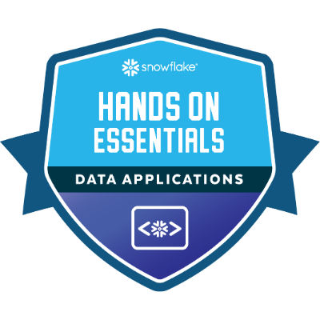

# icp-bootcamp-2025

This repo is for archiving my Accenture's "Cloud & Automation w/ Data Intelligence" bootcamp homework/labwork & for providing it in a neat package to the trainer of any given module.

If a module is skipped, that means there was either no homework, or the assigned labwork/homework didn't warrant documentation.

## Badges gained during bootcamp

